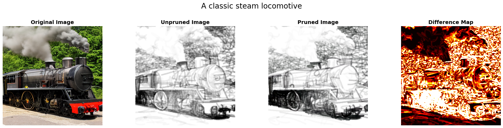
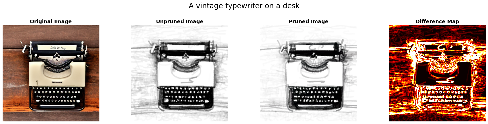
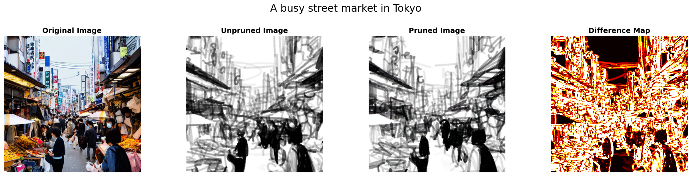
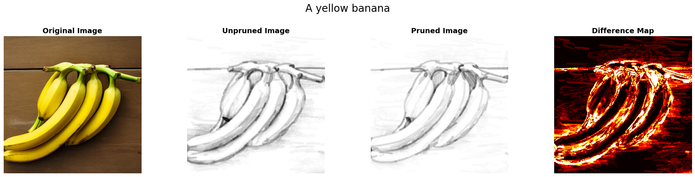
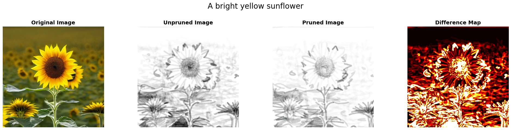
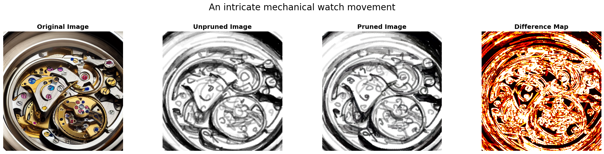
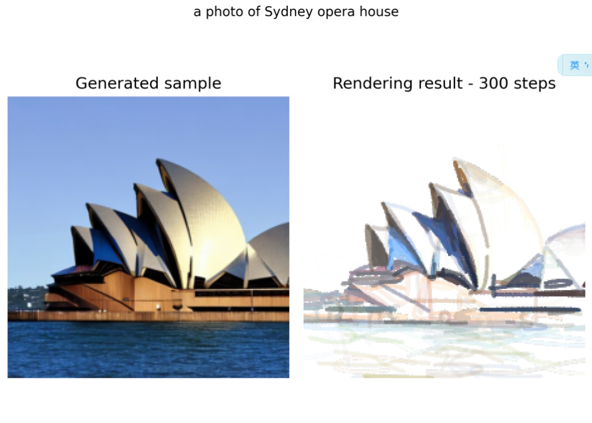
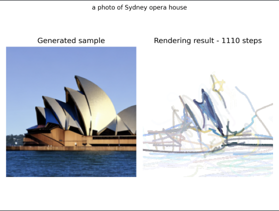

# DiffSketcher with Soft Opacity-Based Regularization

This repository contains an enhanced implementation of **DiffSketcher** with **Soft Opacity-Based Regularization (Soft-OBR)**, a novel dynamic pruning mechanism that eliminates redundant "ghost strokes" while preserving semantic quality.

## 🎯 Our Innovation: Soft-OBR

**Problem**: The original DiffSketcher suffers from the "ghost stroke" phenomenon, where the model generates numerous low-opacity, semi-transparent strokes that:
- Bloat SVG files with invisible paths
- Reduce abstraction quality
- Waste computational resources

**Solution**: We introduce **Soft-OBR (Soft Opacity-Based Regularization) with Exponential Moving Average (EMA)**, a training-free dynamic pruning strategy that:

### ✨ Key Features

1. **EMA-Based Temporal Tracking**: Monitors stroke opacity over time to distinguish between temporarily low-opacity strokes (during repositioning) and persistently redundant "ghost strokes"

2. **Unilateral Regularization**: Unlike traditional binarization losses, our method only penalizes low-opacity strokes, preserving the model's ability to use semi-transparent overlays for shadows and subtle effects

3. **Two-Stage Pruning**:
   - **Training Phase**: Soft deletion - redundant strokes fade to near-zero opacity but remain in the computation graph to maintain optimizer stability
   - **Export Phase**: Hard deletion - strokes below threshold (α < 0.01) are filtered out during SVG export

4. **Content-Aware Adaptation**: Automatically adjusts pruning intensity based on scene complexity

### 📊 Results


*Classic Steam Locomotive: Shows original image, unpruned baseline, pruned result (438 strokes, 14.5% reduction), and difference map highlighting removed ghost strokes*


*Vintage Typewriter: Unpruned  vs Pruned*


*Busy Street Market in Tokyo: Complex scene with conservative pruning to preserve architectural details*

**Quantitative Evaluations**:
- **Average stroke reduction**: almost 19% across varying complexity levels
- **CLIP Score maintained**: 0.414 (baseline) vs 0.414 (ours) - zero semantic degradation
- **LPIPS**: 0.083 - visually imperceptible differences


## 📌 Installation Guide

To quickly get started with **DiffSketcher + Soft-OBR**, follow the steps below.

#### 🚀 **Option 1: Standard Installation**

Run the following command in the **top-level directory**:

```shell
chmod +x script/install.sh
bash script/install.sh
```

This will create a conda environment named `svgrender` with all required dependencies.

#### 🐳 Option 2: Using Docker

```shell
chmod +x script/run_docker.sh
sudo bash script/run_docker.sh
```

**Critical Dependencies**:
- PyTorch 1.12.1 with CUDA 11.3 (or CPU-only)
- diffusers==0.20.2 (version is important)
- DiffVG (cloned and built from source)
- xformers (optional, for speed)

**Note**: If using `xdog_intersec=True` for edge-aware initialization, download the U2Net model:
- Download from: https://huggingface.co/akhaliq/CLIPasso/blob/main/u2net.pth
- Place in: `checkpoint/u2net/u2net.pth`

## 🔥 Quickstart with Soft-OBR

### Basic Usage

```shell
python run_painterly_render.py \
  -c diffsketcher.yaml \
  -eval_step 10 -save_step 10 \
  -update "token_ind=4 num_paths=512 num_iter=500 prune_loss_weight=10.0 prune_ema_threshold=0.02 prune_start_step=200" \
  -pt "A classic steam locomotive" \
  -respath ./workdir/steam_locomotive \
  -d 0 \
  --download
```

### Key Soft-OBR Parameters

Add these parameters via `-update` to enable and control pruning:

- **`prune_loss_weight`**: Weight of the pruning regularization loss (default: 10.0)
  - Higher values → more aggressive pruning
  - Range: 0.1 (minimal) to 50.0 (very aggressive)
  - Set to 0 to disable pruning (baseline DiffSketcher)

- **`prune_ema_threshold`**: EMA threshold to identify dead strokes (default: 0.02)
  - Strokes with smoothed opacity < threshold are marked for pruning
  - Lower values → more conservative pruning

- **`prune_start_step`**: Start applying pruning loss after this many steps (default: 200)
  - Warmup period allows model to establish coarse structure first

### Example: Simple Object (Aggressive Pruning)

```shell
python run_painterly_render.py \
  -c diffsketcher.yaml \
  -eval_step 10 -save_step 10 \
  -update "token_ind=2 num_paths=512 num_iter=500 prune_loss_weight=20.0 prune_ema_threshold=0.05" \
  -pt "A bright yellow sunflower" \
  -respath ./workdir/sunflower \
  -d 0
```

### Example: Complex Scene (Conservative Pruning)

```shell
python run_painterly_render.py \
  -c diffsketcher.yaml \
  -eval_step 10 -save_step 10 \
  -update "token_ind=4 num_paths=512 num_iter=500 prune_loss_weight=5.0 prune_ema_threshold=0.02" \
  -pt "An intricate mechanical watch movement" \
  -respath ./workdir/watch \
  -d 0
```

### Batch Testing Across Random Seeds

```shell
python run_painterly_render.py \
  -c diffsketcher.yaml \
  -eval_step 10 -save_step 10 \
  -update "token_ind=4 num_paths=512 num_iter=500 prune_loss_weight=10.0" \
  -pt "A vintage typewriter on a desk" \
  -respath ./workdir/typewriter \
  -rdbz -srange 0 10
```

This will run experiments with seeds 0-9 for statistical robustness.

## 🎨 More Examples

### Simple Objects (High Pruning Rate)


*Yellow Banana: 29.7% stroke reduction (512 → 360 strokes)*


*Bright Yellow Sunflower: 21.7% stroke reduction (512 → 401 strokes)*

### Complex Scenes (Conservative Pruning)


*Intricate Mechanical Watch: 8.0% stroke reduction (512 → 471 strokes) - preserves gear details*

## ⚠️ Note on Failed Approaches

> **Failed Extension: Directional CLIP Loss for Style Transfer**
>
> During development, we explored extending DiffSketcher with Directional CLIP Loss to enable style transfer while preserving geometric structure. However, this approach encountered fundamental incompatibilities:
>
> | Baseline (Without Directional CLIP Loss) | With Directional CLIP Loss |
> |:----------------------------------------:|:-------------------------:|
> |  |  |
> | **300 iterations**: Structurally accurate rendering preserves the Opera House's iconic shell architecture | **1110 iterations**: Severe geometric collapse - control points shift chaotically, destroying structural integrity |
>
> - **CLIP Semantic Entanglement**: CLIP's embedding space does not cleanly factorize style and content. The direction vector for artistic styles (e.g., "Van Gogh style") encodes not only color/texture but also geometric deformations, causing structural collapse.
> - **Vector Parameterization Bottleneck**: Unlike pixel-based methods, vector sketches couple appearance and geometry through explicit control points. Any non-trivial style change requires geometric modification, creating an irreconcilable conflict.
> - **Key Observation**: The baseline achieves structural accuracy in 300 steps, while the directional CLIP loss causes catastrophic failure even after 1110 iterations.
>
> This negative result demonstrates the unique challenges of applying pixel-based style transfer techniques to structured vector representations. The failed implementation is preserved in the `failed-attempt` branch for reference and lessons learned.

## :books: Acknowledgement

This work is based on the original DiffSketcher:

- [ximinng/DiffSketcher](https://github.com/ximinng/DiffSketcher) - Original DiffSketcher implementation
- [BachiLi/diffvg](https://github.com/BachiLi/diffvg) - Differentiable vector graphics
- [yael-vinker/CLIPasso](https://github.com/yael-vinker/CLIPasso) - CLIP-based sketch synthesis
- [huggingface/diffusers](https://github.com/huggingface/diffusers) - Diffusion model library

We gratefully thank the authors for their wonderful works.


## :copyright: Licence

This work is licensed under a MIT License.